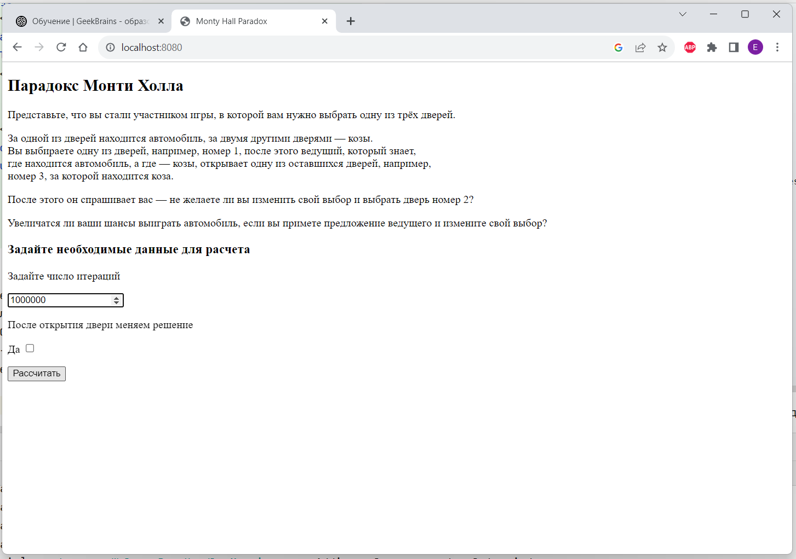
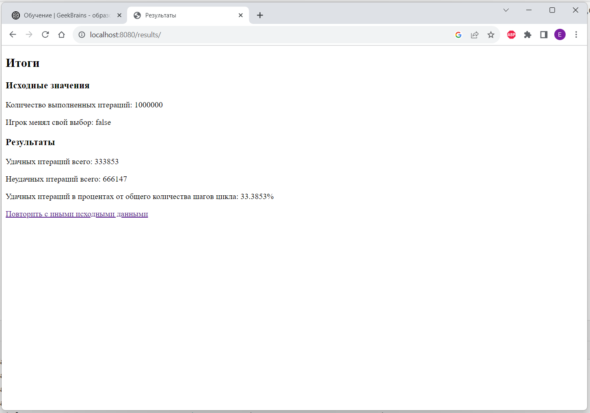
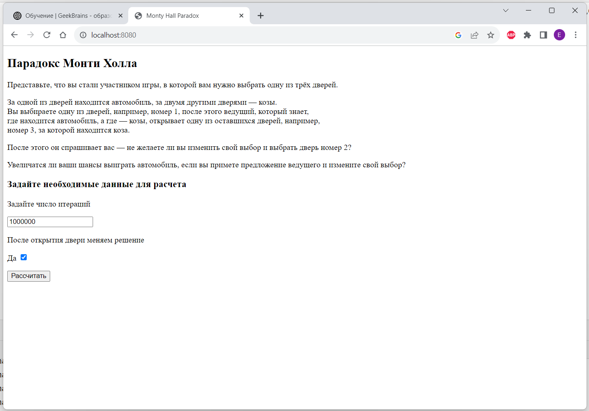
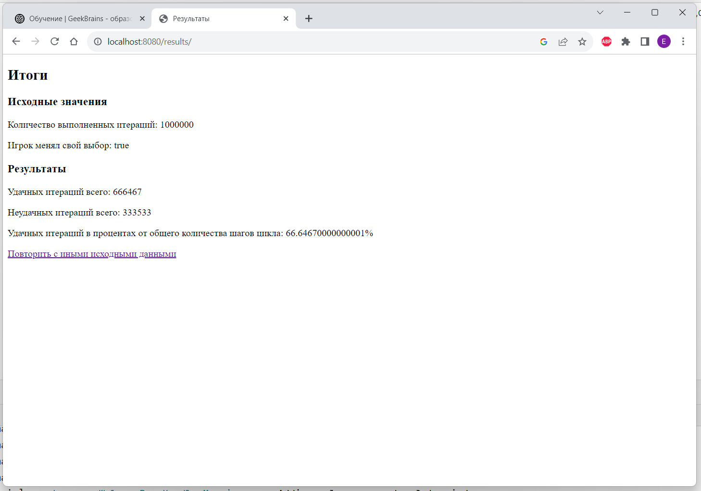

# Monty Hall Paradox
## Задача
- Создать свой Java Maven/Gradle проект;
- Реализовать прикладную задачу - приложение для демонстрации парадокса Монти Холла;
- Можно добавить любые библиотеки которые считают необходимыми
- Результаты должны быть сохранены в HashMap (шаг цикла -> результат)
- Необходимо вывести статистику по результату - количество позитивных и негативных результатов, процент от общего количества шагов цикла.
## Решение
1. Создаем Maven-проект, подключаем необходимые библиотеки

Thymeleaf - для реализации шаблонов.  
Lombok - генерации Getter, Setter и пр. классов сущностей.
```xml
<?xml version="1.0" encoding="UTF-8"?>
<project xmlns="http://maven.apache.org/POM/4.0.0" xmlns:xsi="http://www.w3.org/2001/XMLSchema-instance"
         xsi:schemaLocation="http://maven.apache.org/POM/4.0.0 https://maven.apache.org/xsd/maven-4.0.0.xsd">
    <modelVersion>4.0.0</modelVersion>
    <parent>
        <groupId>org.springframework.boot</groupId>
        <artifactId>spring-boot-starter-parent</artifactId>
        <version>3.1.5</version>
        <relativePath/> <!-- lookup parent from repository -->
    </parent>
    <groupId>ru.letdigit</groupId>
    <artifactId>MHParadox</artifactId>
    <version>0.0.1-SNAPSHOT</version>
    <name>MHParadox</name>
    <description>MHParadox</description>
    <properties>
        <java.version>17</java.version>
    </properties>
    <dependencies>
        <dependency>
            <groupId>org.springframework.boot</groupId>
            <artifactId>spring-boot-starter-thymeleaf</artifactId>
        </dependency>
        <dependency>
            <groupId>org.springframework.boot</groupId>
            <artifactId>spring-boot-starter-web</artifactId>
        </dependency>

        <dependency>
            <groupId>org.projectlombok</groupId>
            <artifactId>lombok</artifactId>
            <optional>true</optional>
        </dependency>
        <dependency>
            <groupId>org.springframework.boot</groupId>
            <artifactId>spring-boot-starter-test</artifactId>
            <scope>test</scope>
        </dependency>
    </dependencies>

    <build>
        <plugins>
            <plugin>
                <groupId>org.springframework.boot</groupId>
                <artifactId>spring-boot-maven-plugin</artifactId>
                <configuration>
                    <image>
                        <builder>paketobuildpacks/builder-jammy-base:latest</builder>
                    </image>
                    <excludes>
                        <exclude>
                            <groupId>org.projectlombok</groupId>
                            <artifactId>lombok</artifactId>
                        </exclude>
                    </excludes>
                </configuration>
            </plugin>
        </plugins>
    </build>

</project>
```
2. Создаем два класса предметной области GameParameter и MHResult для 
задания параметров вычислений и выдачи результатов соответственно.
3. Создаем контроллер MHController. Контроллер обрабатывает Post-запрос 
задания параметров и Get-запросы выдачи результатов и формой ввода исходных данных.
4. Логика вычислений определена в классе-сервисе MHService.

### Исходные данные (игрок не меняет мнения)

Результат


### Исходные данные (игрок меняет мнение)

Результат

